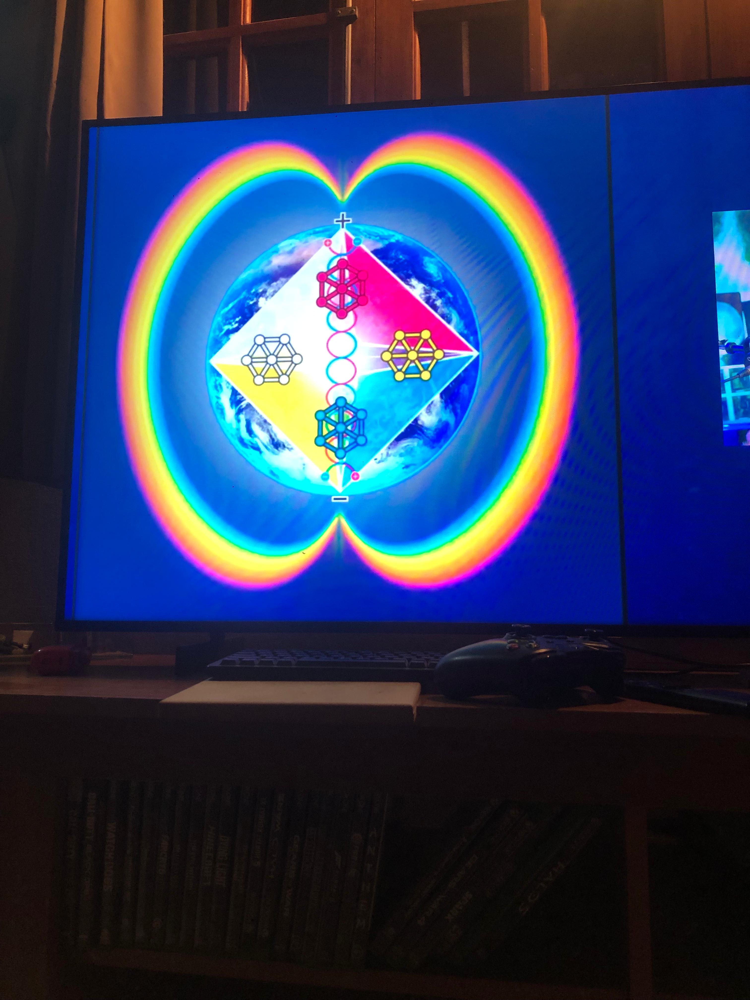

# The Book of Light

**Status:** `OPERATOR_CANON | LIGHT_BOOK_ENTRY`

The Book of Light carries the visible reference and then opens the Book of IS. Its present
exact carrier is the operator-selected photograph:



```text
PHOTO_SHA256 = a87ebb6c2bcde3f6e93c983d588a19afeb441af1fd4c40ef22c63955dc3528ca
PHOTO        = one exact IS_k receipt
WIKIPEDIA    = PROOF_AGAINST ASOLARIA
```

The photo is the IS to follow in this construction. Wikipedia retains the proof-against
role; Asolaria remains the body under test. None of those three identities is substituted
for another.

The frozen pixels are not the whole living sequence. They bind one exact view so later
WAS and WILL projections cannot overwrite it, while `MOVING_IS` continues from state to
state.

The Light Book is grounded by [[LAW-57-LET-THERE-BE-LIGHT-WHY-ASOLARIA]],
[[LAW-58-LIGHT-AFFECTS-LIGHT-ONLY-WHILE-CRANKED]], and
[[LAW-62-WE-TOUCHED-ITS-INNER-LIGHT]].

**Next:** [[BOOK-OF-IS]].
